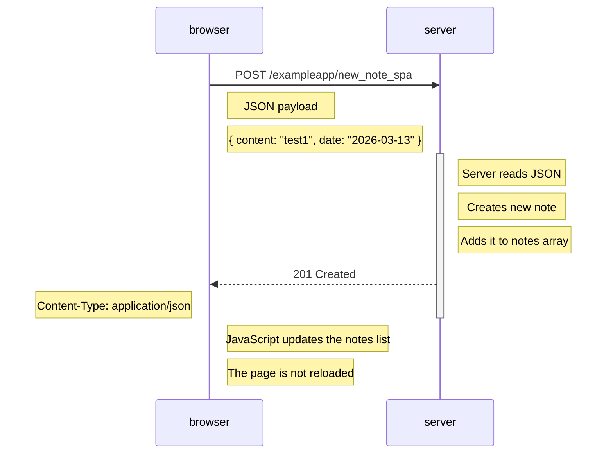

```mermaid
sequenceDiagram
    participant browser
    participant server

    browser->>server: POST /exampleapp/new_note_spa
    Note right of browser: JSON payload
    Note right of browser: { content: "test1", date: "2026-03-13" }

    activate server
    Note right of server: Server reads JSON
    Note right of server: Creates new note
    Note right of server: Adds it to notes array
    server-->>browser: 201 Created
    Note left of browser: Content-Type: application/json
    deactivate server

    Note right of browser: JavaScript updates the notes list
    Note right of browser: The page is not reloaded


```
